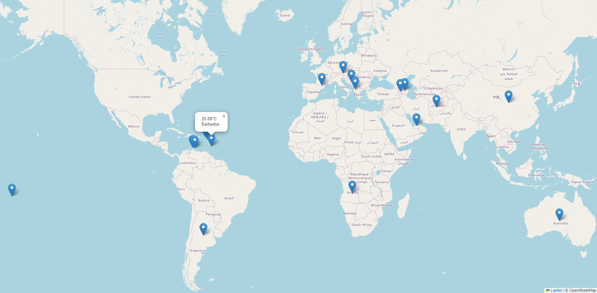

# Spring-boot-map-geolocalisation-weather
## API uses :
    > OpenStreetMap
    > OpenWeather
    > CSV file that contains coordinates of all countries
## Run process:
    > Gets information about all countries
    > Using longitude and latitude send GET method to OpenWeather API 
    > Gets current temperature from previous API
    > Send Point object to HTML and make a pointer from this
    
 
